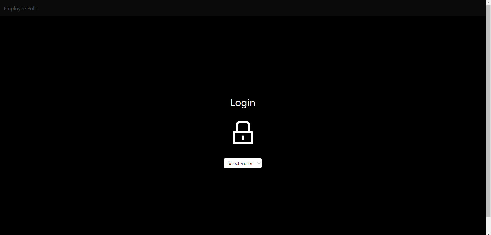
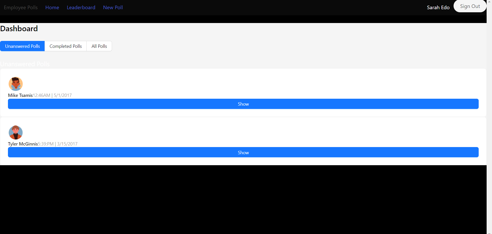
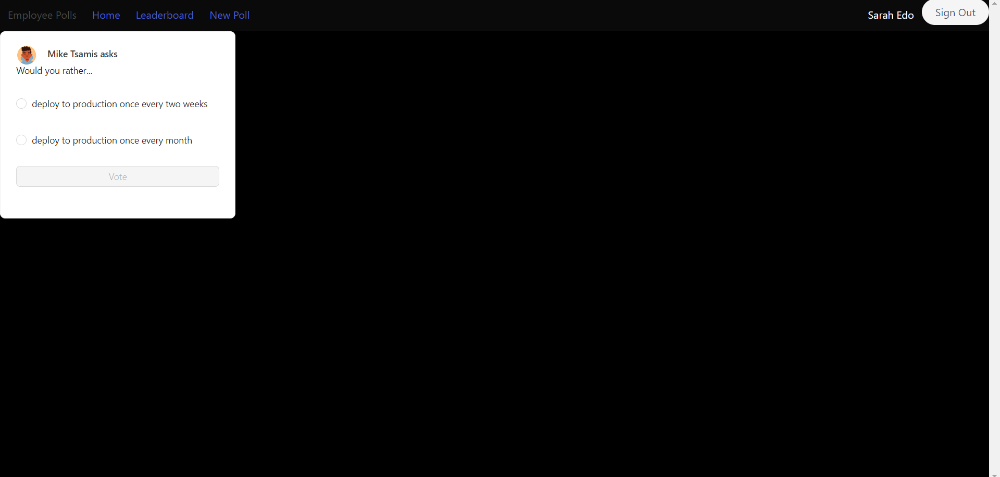
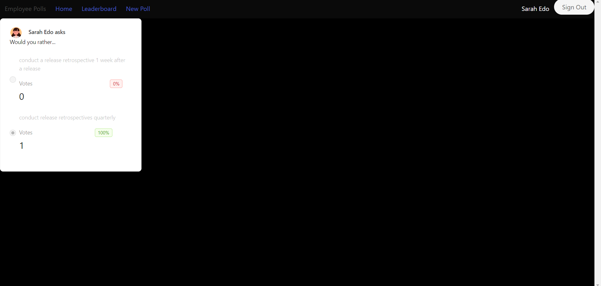
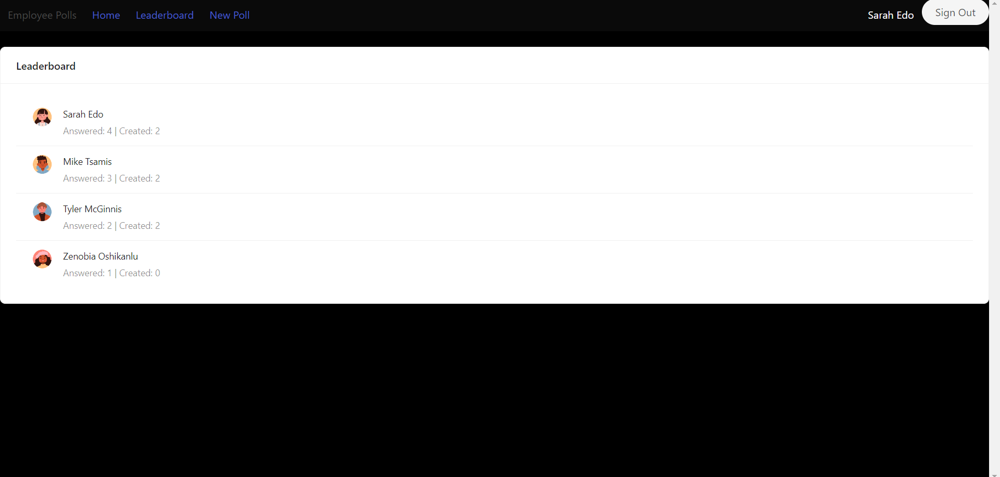
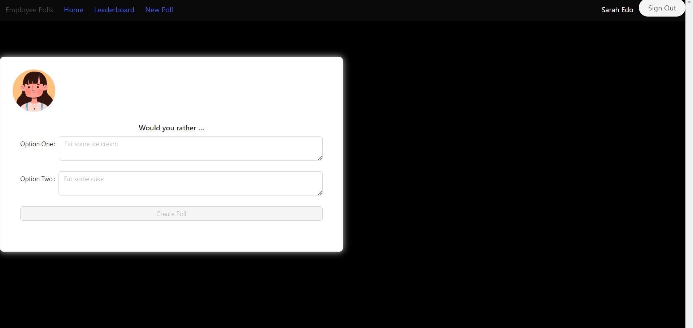

# Employee Polls - Web App Project by Udacity

## About Employee Polls

Employee Polls is a tool for generating and participating in polls within a group. Each polls offers two choices: "Option A or Option B?"

1. Log in => select a user from the list to log in
2. Dashboard => switch between completed, all and pending polls
3. Polls => select a poll to view it individually and select a radio button to make a choice
4. New polls => create a new polls with two options
5. Leaderboard => view which user has submitted the most queries and responses.

## Getting Started

- Clone the repository `git clone https://github.com/prosenjeetshil/Employee-Polls-Udacity.git`
- Please use `npm install` to install dependencies. use `npm start` to start the app.
- The project can be viewed in the browser at [http://localhost:3000](http://localhost:3000)
- Please use `npm test` to launches the test runner in the interactive watch mode.

## Screenshots

### Login

### Dashboard

### Unanswered Polls

### Answered Polls

### Leaderboard

### New Polls

